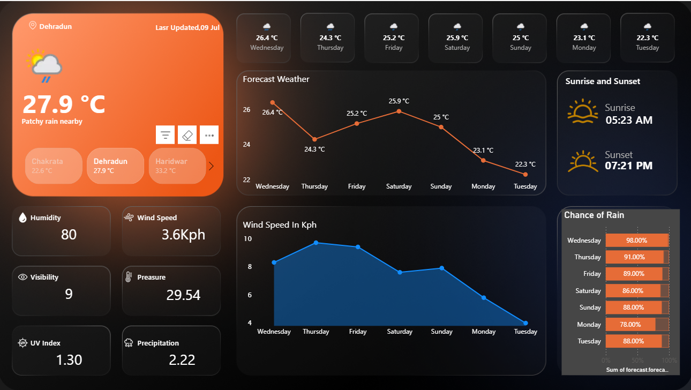

# 🌦️ Power BI – Live Weather Dashboard

## 📌 Overview
This is a real-time **Weather Dashboard** for **Dehradun ,Chakrata, Haridwar, rishikesh, roorkee** built in Power BI. It fetches data from a **live weather API** and visualizes various meteorological insights like temperature, wind speed, humidity, UV index, and more.

## 🔗 Live Dashboard
[👉 View Dashboard on Power BI Service](https://app.powerbi.com/view?r=eyJrIjoiMGI0MjZjNmQtMzhkYi00YWRlLWE5ZTItN2JlMGZhNmFkOWNhIiwidCI6IjhmYjA5YWMzLTAzYjItNDRkNy05ZTZhLTM0YzUyMzhmNjZjZiJ9)

> ⚠️ Shared via Power BI Service with public “Publish to Web” link.

## 📊 Key Features
- 📍 **Location-Based Weather**: Dehradun, Chakrata, Haridwar
- 🌡️ **Live Temperature & Conditions**
- 📈 **7-Day Forecast Chart**
- 💧 **Humidity, Wind Speed, UV Index**
- 🌅 **Sunrise & Sunset Times**
- 🌧️ **Chance of Rain Bar Graph**
- 🔄 **Auto-refresh from Weather API**

## 📁 Files Included
- `Weather_Dashboard.pbix` – Main Power BI file
- `/screenshots/` – High-quality screenshots of dashboard visuals
- `README.md` – Project documentation

## 🛠️ Tools Used
- Power BI Desktop & Power BI Service
- Power Query for API connection
- DAX for measures
- REST API (for weather data)
